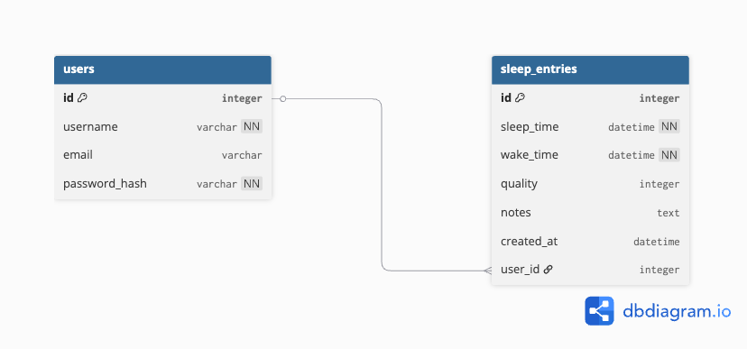

# Sleep-Tracker-API
This is a RESTful Flask API that allows users to track their sleep.

Users can:
	•	Register and login securely
	•	Create sleep records (sleep time, wake time, quality, notes)
	•	View only their own sleep data
	•	Update and delete their sleep entries
	•	Use JWT authentication for secure access
	•	View paginated results

Each user has private data that cannot be accessed by other users.

# Tech Stack

	•	Flask
	•	Flask-SQLAlchemy
	•	Flask-Migrate
	•	Flask-Bcrypt
	•	Flask-JWT-Extended
	•	SQLite Database

## Database Diagram





# Setup Instructions

## 1. Clone the Repository

```bash
gh repo clone waynekiprotich/Sleep-Tracker-API
cd Workout-API
```

## 2. Create Virtual Environment
1.mac/linux
```bash
python -m venv .venv
source .venv/bin/activate   
```
2.windows
```bash
python -m venv .venv
.venv\Scripts\activate
```

## 3 Install Dependencies

```bash
pip install -r requirements.txt
```
## 4. Set Up Database

```bash
flask --app app db init
flask --app app db migrate -m "initial migration"
flask --app app db upgrade
```
## 5. Seed the Database

```bash
python seed.py
```

## 6. Run the Application

```bash
flask --app app run
```

The API will be available at:

```bash
http://127.0.0.1:5555
```
## Testing API

# 1. Home Route

```bash
GET /
```
# 2: Register User

```bash
POST /signup
```
# 3: Login User

```bash
POST /login
```

# 4: Create Sleep Entry

```bash
POST /sleep
```

#  5: Get Sleep Entries (Pagination)

```bash
GET /sleep?page=1&per_page=5
```

# 6: Update Sleep Entry

```bash
PATCH /sleep/1
```

# 7: Delete Sleep Entry

```bash
DELETE /sleep/1
```
## Security Features
	•	Passwords are hashed using bcrypt
	•	JWT authentication required for all sleep routes
	•	Users can only access their own data

## Author
Student Backend Project – Flask Sleep Tracker API

